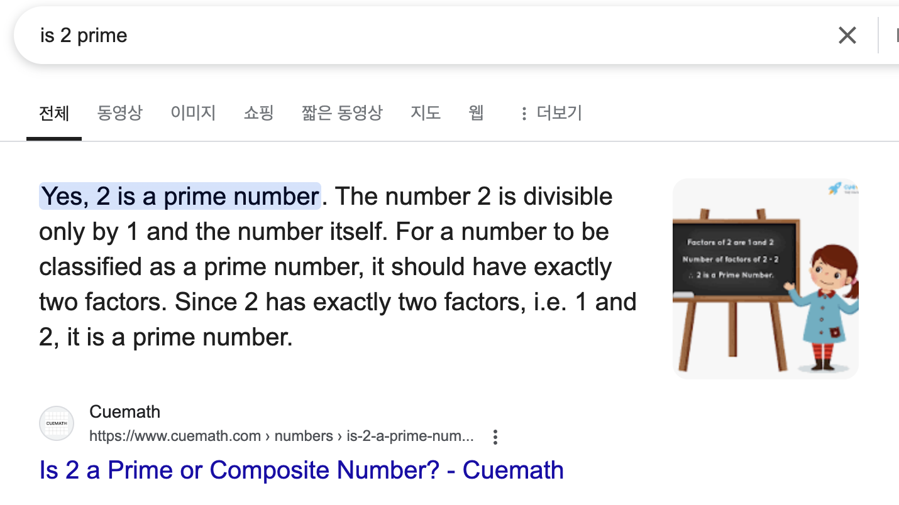
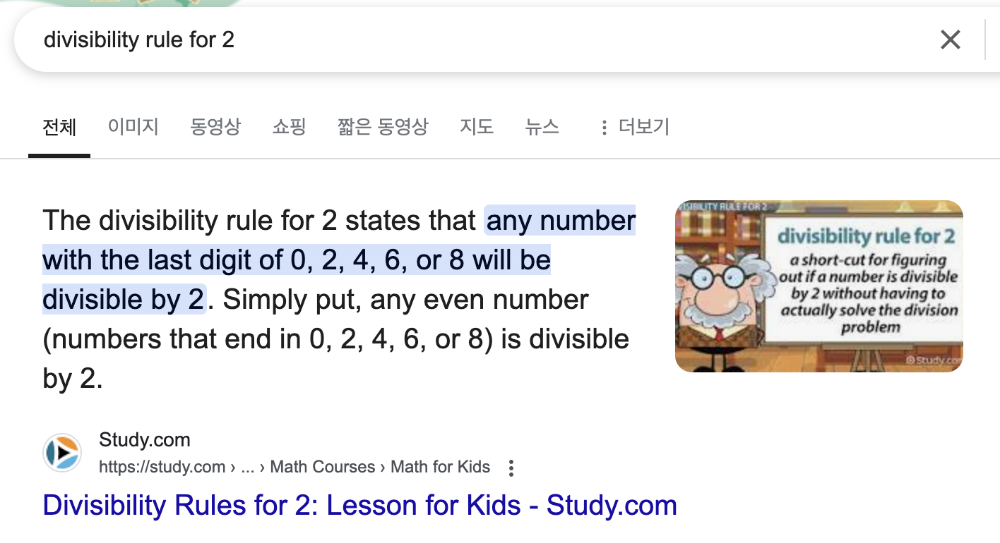

# EVEN RSA CAN BE BROKEN???

### Description

> This service provides you an encrypted flag. Can you decrypt it with just N & e?  
> Connect to the program with netcat:  
> $ nc verbal-sleep.picoctf.net 53723  
> The program's source code can be downloaded here.

---

### Attack

~ *RandomPerson3108 pov*

This was definitely one of the hardest challenges in the entire CTF, since the values were truly created by complete random.

**Table of Contents**
- [EVEN RSA CAN BE BROKEN???](#main)
    - [Description](#description)
    - [Attack](#attack)
      - [Value of N](#)

#### Value of N

If you look closely at whatever the value of N that you have, you can notice that the value of N is actually a number.

Figuring out that the value of N was a number was not very useful for solving the challenge, so I decided to look for some quick prime numbers that I can maybe divide the number with.

According to [Cuemath](https://www.cuemath.com/numbers/is-2-a-prime-number/), 2 is a prime number. Although I wasn't sure if this was the most credible source, I decided to go ahead and divide the number with 2.

However, before I divided the number, I just wanted to check if the value of N was really divisible by 2.

According to [Study.com](https://study.com/academy/lesson/divisibility-rules-for-2-lesson-for-kids.html), the divisility rule for 2 was that the number ends with either 0, 2, 4, 6, 8. After careful inspection at the value of N again, it was miraculously found that the value of N was in fact divisible by 2!

work in progress