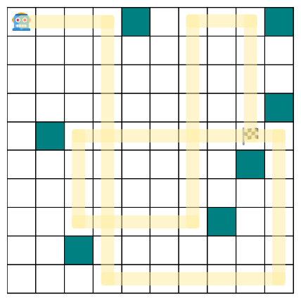

# Ricochet

### Description

> I bought this robot to help me locate flags, but the controller is stuck in a demo loop where the robot just goes in circles. Can you exploit the encryption between the controller to navigate the robot to the flag? Go to this web page for more instructions on how to interface with this challenge. All connections to the challenge will be made via the browser and/or HTTP requests to the server. You will need to use the functions provided in radio_interface.py to interface with the server. The source code for the robot and controller will be useful as well: robot.py; robotcontroller.py; crypto.py

This challenge consisted of a robot and a robot controller communicating over the air on radio. Unfortunately, the robot controller is stuck in a demo loop and can't get to the flag. Our job is to hijack the robot by sending radio messages and guide it to the flag.

---

### Attack

#### Part 1: Man-in-the-Middle Attack on Diffie Hellman

The first thing I noticed was this suspicious-looking block of code in robotcontroller.py
```py
# To avoid the bootstrapping problem, changing the address needs to
# be an unauthenticated operation
if msg_type == "set_addr":
    self.address = int(msg["new_addr"]) & 0xFF
    self.send_message({
        "msg_type": "ack_set_addr",
        "src": self.address,
        "dst": msg["src"]
    })
```

We were given arbitrary access to change the robot controller's address without needing any type of verification. This meant that we could control the messages that the controller sends and receives.

Looking at robot.py, the robot starts by sending an authenticity challenge, then setting up a Diffie-Hellman (DH) key exchange for future communications. At this point, it became obvious that we were looking at a Man-in-the-middle attack on DH. The authenticity challenge can also be easily bypassed by relaying the challenge from the robot to the controller.

Here's how we'll setup this attack:
1. Change the controller's address to something else (0x30)
    ```py
    inject_radio_message({'msg_type': 'set_addr', 'new_addr': 0x30, 'dst': 0x10})
    receive_radio_messages()
    ```
2. Solve authenticity challenge:
    * Receive the authenticity challenge from the robot (0x20) and relay it directly to the controller (0x30)
    * Relay the response back to the robot 
    ```py
    # receive challenge
    challenge = receive_radio_messages()[0]

    # send challenge
    challenge['dst'] = 0x30; challenge['src'] = 0x10
    inject_radio_message(challenge)

    # send response
    response = receive_radio_messages()[0]
    response['dst'] = 0x20; challenge['src'] = 0x10
    inject_radio_message(response)
    ```
4. Setup two DH shared keys, one with robot, one with controller 
    * Create some random private key (b'A' * 32), and compute its public key
    * Receive public key from robot, send ACK with our public key to robot, compute shared key 1
    * Send our public key to controller, receive ACK message with its public key, compute shared key 2
    ```py
    priv_key = b'A' * 32

    # compute key with robot
    key_exchange = receive_radio_messages()[1]
    inject_radio_message({"msg_type": "ack_key_exchange", "src": 0x10, "dst": 0x20, "key": monocypher.compute_key_exchange_public_key(priv_key).hex()})
    shared_key1 = monocypher.key_exchange(priv_key, bytes.fromhex(key_exchange['key']))

    # save for later (this is a secure_data 'get_message' msg)
    msg = receive_radio_messages()[0]

    # compute key with controller
    inject_radio_message({"src": 0x10, "dst": 0x30, "msg_type": "key_exchange", "key": monocypher.compute_key_exchange_public_key(priv_key).hex()})
    key_exchange = receive_radio_messages()[0]
    shared_key2 = monocypher.key_exchange(priv_key, bytes.fromhex(key_exchange["key"]))
    ```

With this, we have shared keys for both the robot and the controller, allowing us to encrypt and decrypt their messages.

#### Part 2: Getting the Flag

Even though we have the shared keys, however, each message is still hashed with a nonce and a secret `shared_hmac_key`, making it very difficult to forge messages. Instead, we're going to have to reuse the robot/controller's own messages to get to the flag.

Here's the path the robot will need to take:



Mapping out the instructions and comparing to the demo program, I got this:

| Turn  | Nonce* | Instruction| Demo Program |
| ----- | ------ | ---------- | ------------ |
| 0     | 1      | East       | East         |
| 1     | 3      | South      | South        |
| **2** | **5**  | **East**   | **West**     |
| 3     | 7      | North      | North        |
| **4** | **9**  | **West**   | **East**     |
| 5     | 11     | South      | South        |
| **6** | **13** | **East**   | **West**     |
| 7     | 15     | North      | North        |
| 8     | 17     | East       | East         |
| 9     | 19     | South      | South        |

\* Every even nonce is just a `get_movement` request (omitted from table). 

Interestingly, only 3 out of 10 instructions needed to be modified to reach the flag. We can get the remaining 7 instructions by simply relaying the instructions from the controller. But how do we get the other three?

Looking back at robotcontroller.py, I noticed that the movement counter only updates from `get_movement` requests:

```py
async def run(self):
    while self.running:
        await asyncio.sleep(0.05)
        # Wait for the secure messaging layer to provide a secure command
        if self.recv_buffer_secure == "get_movement":
            self.recv_buffer_secure = ""

            # Demo version sends the same four commands repeatedly
            # Full control is available in the licensed version of this system
            self.send_buffer_secure = ["east", "south", "west", "north"][self.movement_counter % 4]
            self.movement_counter += 1
```

This means that you can increase the nonce without increasing the movement counter by sending movement requests.

If we can stall the controller for 2 turns (4 nonces) while operating the robot normally by saving and reusing the controller's usual responses, then the robot will start moving **east at nonce 5**, then south at nonce 7, **west at nonce 9**, north at nonce 11, and **east at nonce 13**. These are exactly the three instructions we need to get to the flag!

In order to get this 4-nonce offset, here's the first 5 instructions we'll have to send to the robot and controller:

| Nonce | Robot      | msg_type             | Controller    | msg_type            |
| ----- | ---------- | -------------------- | ------------- | ------------------- |
| 0     | ''         | secure_data_ack      | ''            | secure_data_request |
| 1     | 'EAST'     | secure_data_response | ''            | secure_data_request |
| 2     | ''         | secure_data_response | ''            | secure_data_request |
| 3     | ''         | secure_data_response | ''            | secure_data_request |
| 4     | ''         | secure_data_response | 'get_message' | secure_data         |

The `msg_type` attribute can be easily modified for any message because we know the shared DH key, and msg_type is not part of the hash. That means all we need now is the hash for empty strings from nonces 0-4. Coincidentally, the message contents for secure_data_ack and secure_data_request are both `''`, and one of the 2 messages are sent for every nonce, giving us exactly what we need.

<pre style="text-wrap: nowrap">
{'nonce': 0, 'message': 'get_movement', 'hmac': '1518a429592509bde4c1fffd735f5008b8e4f706e45c2b573bb545df09b0b7e1447bda3901ee33ef7167cfcd6b005016d637b135d74081fe01b6b68d8da8d0c9'}
{'nonce': 0, 'message': '', 'hmac': '22e192439f615f06194ec174776e023aa2335af2a9e129cf027d71cd0b24aae36d2aa72f32dd8af15ea5c9eb55b351f781fb0f71715dcb39cde36fcb3b4777a2'}
{'nonce': 1, 'message': '', 'hmac': 'd92cfe785dc733c1aedb79e0c5012b90ec63c4a6140196d03cc5ab7e29050f7241cdf55313aad3adc4683fe51092d0b2f1d2673f5a62c04edad1589d23176f96'}
{'nonce': 1, 'message': 'east', 'hmac': '24010ce07af5592f35eb4ad97b7207d63f8dcc1ac8c1be9dfeb87a27356ba49a2e570f41ff6b9b2bc4f45e0a9fa6d8d5a8f14a0c823f13ac7c1790c944c09d19'}
{'nonce': 2, 'message': 'get_movement', 'hmac': '55721a13f3c1bea0374108f83e7313b0743bf4e35e3d3c7c0ec2ac155405a09f163b4b63e258863bcd8daaf8194a92d6f3a77a0ad4fccf0dc85791ebf9e721d6'}
{'nonce': 2, 'message': '', 'hmac': '23ada8cb625b2dccd22b77f3df88bba7f2f234dc6b1b6edacb9c461de3d50bc7ffd5d2f5b2dd3851d8096ed545f0f427b2ab71d9a2fef810041bf5b26873bf19'}
{'nonce': 3, 'message': '', 'hmac': 'ba2d95a2b70915750e4a05aa098a7619ce06eefbb4ec9945b635948121839ab2b1b741883b4e4a06bf8643cd0580733e1b34c85470faa284dd366fbb2a15668b'}
{'nonce': 3, 'message': 'south', 'hmac': 'eb1775ad75e886dd392d2dd3d5ba9435e6ca7fbb6c35b0a17302fdfcf35571545c0fae889e8e3e3a064a3199c702d0ee6fa4aaa5635eaa8fb8a4149ac0f97e65'}
{'nonce': 4, 'message': 'get_movement', 'hmac': '480b8728aa0eb5b0abe58043821dda6093119e506dbba26be2f94f660195ff6e188666e79a4306de9b6f0b9db321b00fa19dddf5c568dcf9d3f3ea81af0a5a84'}
{'nonce': 4, 'message': '', 'hmac': '7af3aee816f9427d04478775f446d3b9fdd2b0ec726421c2138b4e30449b9440d40a640a5675608e5e83dace2924c13339aeafd88e09e3637c075ef027360838'}
</pre>

We now have everything we need to get the flag. There will be a total of three runs.

Run 1: Collecting default messages and `''` messages for nonces 0-4

Run 2: Collecting offset instructions using the messages collected in Run 1

Run 3: Using default movements and offset instructions from Run 2 to get to the flag

---

### Solution

See solve.ipynb